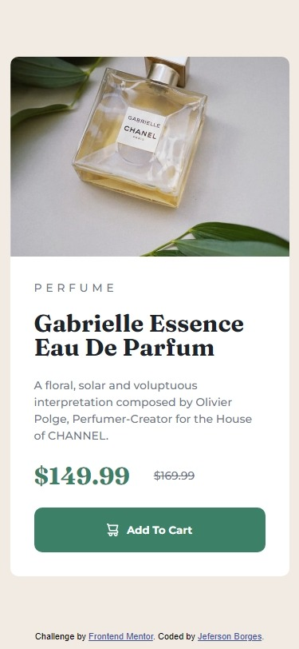

# Frontend Mentor - Product preview card component solution

This is a solution to the [Product preview card component challenge on Frontend Mentor](https://www.frontendmentor.io/challenges/product-preview-card-component-GO7UmttRfa).

## Table of contents

- [Overview](#overview)
  - [The challenge](#the-challenge)
  - [Screenshot](#screenshot)
  - [Links](#links)
- [My process](#my-process)
  - [Built with](#built-with)
  - [Continued development](#continued-development)
  - [Useful resources](#useful-resources)
- [Author](#author)
- [Acknowledgments](#acknowledgments)

## Overview

### The challenge

Users should be able to:

- View the optimal layout depending on their device's screen size
- See hover and focus states for interactive elements

### Screenshot

#### Desktop

#### Mobile

### Links

- Solution URL: [Add solution URL here](https://github.com/jefersonBorges/fem-product_preview_card)
- Live Site URL: [Add live site URL here](https://jefersonborges.github.io/fem-product_preview_card/)

## My process

### Built with

- Semantic HTML5 markup
- SASS
- Flexbox

### Continued development

- Keep improving CSS best practices

### Useful resources

- [26 Rules I Follow When Writing CSS To Make It Concise and Readable](https://arbaouimehdi.medium.com/26-rules-i-follow-when-writing-css-to-make-it-concise-and-readable-b56547a345b4) - This article is helping me better organize my CSS coding.

## Author

- GitHub - [jefersonBorges](https://github.com/jefersonBorges/jefersonBorges)
- Frontend Mentor - [@jefersonBorges](https://www.frontendmentor.io/profile/jefersonBorges)
- Linkedin - [Jeferson Borges Linkedin](https://www.linkedin.com/in/jeferson-borges-543b34229)

## Acknowledgments

Thanks to [@Hassiai](https://www.frontendmentor.io/profile/Hassiai) for the helpful feedback on the first solution for this challenge.
